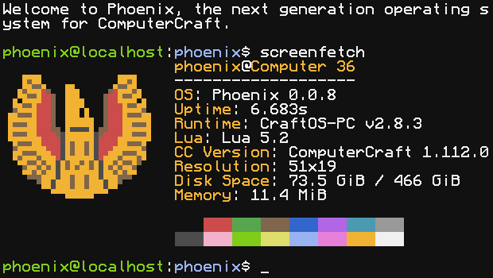

## Hi there 👋

I'm JackMacWindows, a seasoned programmer focusing on writing cool [ComputerCraft](https://github.com/cc-tweaked/CC-Tweaked) programs. I mainly write C/C++ and Lua code, with my passion being embedded and operating system development, but I dabble in various other things too.

My most well-known project is [CraftOS-PC](https://www.craftos-pc.cc), a CC emulator which I've been working on since 2018, and has become a staple of the community, acting as the de facto pick for emulation. It's on the backburner for now, as I consider it pretty much complete, but I try to keep it maintained as best I can.

My favorite project is [Phoenix](https://phoenix.madefor.cc), a full-blown operating system (NOT a fake "OS") for CC. It's a comprehensive project consisting of everything from the kernel to a desktop, with lots of real OS design going into it. The kernel is a mostly monolithic design, featuring preemptive multitasking, a virtual filesystem layer, a device tree with drivers, full TCP/IP networking, and more. On top of the kernel is a suite of libraries: `libsystem` and `libcraftos` for core OS functions (the former being native system calls, and the latter being a reimplementation of CC's CraftOS APIs), plus a bunch of utility libraries for archiving, compression, package management, and more. A POSIX userspace keeps the system familiar to Linux users, with well-known Unix and Linux commands available, including a Bourne-compatible shell interpreter, plus various "manager" services. Finally, a desktop environment inspired by macOS and KDE provides friendly user interaction on top (not available yet).

Besides those two, I've made a huge number of programs and libraries for CC, which are posted on my [Gists](https://gist.github.com/MCJack123) + some repos here. Some highlights:
- [CCKit2: An object-oriented GUI toolkit for ComputerCraft, with support for window servers and graphics mode.](https://github.com/Phoenix-ComputerCraft/CCKit2)
- [sanjuuni: Converts images and videos into a format that can be displayed in ComputerCraft.](https://github.com/MCJack123/sanjuuni)
- [AUKit: Audio decoding and processing framework for ComputerCraft](https://github.com/MCJack123/AUKit)
- [PrimeUI: A collection of UI component primitives for ComputerCraft.](https://github.com/MCJack123/PrimeUI)
- [Herobrine: Herobrine demo for ComputerCraft](https://github.com/MCJack123/Herobrine)
- [Taskmaster: A simple and highly flexible task runner/coroutine manager for ComputerCraft](https://gist.github.com/MCJack123/1678fb2c240052f1480b07e9053d4537)

Outside of CC, I've made a couple of cool things too:
- [PSG: My attempt at designing a programmable sound generator board.](https://github.com/MCJack123/PSG)
- [UnkrawerterGBA: A tool to rip music from Gameboy Advance games that use the Krawall sound engine.](https://github.com/MCJack123/UnkrawerterGBA)
- [PerformanceMeter: A Beat Saber mod that displays a graph at the end of a level showing how your energy bar or score percentage changed over the duration of the level.](https://github.com/MCJack123/PerformanceMeter)
- [pico-icsp-programmer: ICSP programmer for PIC18FxxQxx family devices on Raspberry Pi Pico](https://github.com/MCJack123/pico-icsp-programmer)
- [iRCON: Minecraft server RCON client for iOS/macOS](https://github.com/MCJack123/iRCON)
- [8S1A: An 8-bit CPU(ish) built in Minecraft.](https://mcjack123.github.io/8S1A/)

I have a [blog on dev.to](https://dev.to/jackmacwindows) that I sometimes post on; if you want to hear my ramblings about random things I made, then check it out.

If you need to contact me, I'm always on Discord (unfortunately) at `@jackmacwindows`, usually lurking in the [CC Discord](https://discord.computercraft.cc). For business inquiries, contact me at  (note that Discord is *highly* preferred).
